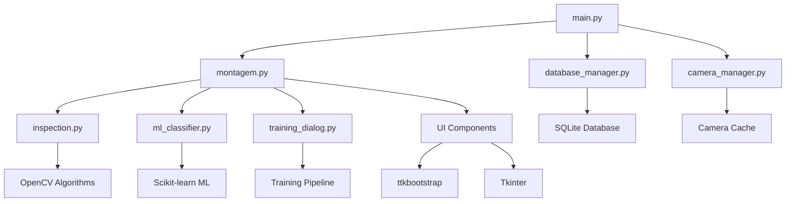

# 🔬 Sistema de Visão Computacional DX v2.0

<div align="center">


-brightgreen.svg)


**Sistema avançado de inspeção visual automatizada para controle de qualidade industrial**

*Desenvolvido pela equipe DX (Desenvolvimento Digital) - Versão 2.1*

</div>

---

## 📋 Índice

- [🎯 Visão Geral](#-visão-geral)
- [✨ Funcionalidades Principais](#-funcionalidades-principais)
- [🆕 Novidades da Versão 2.1](#-novidades-da-versão-21)
- [🏗️ Arquitetura do Sistema](#️-arquitetura-do-sistema)
- [🧮 Algoritmos e Tecnologias](#-algoritmos-e-tecnologias)
- [⚙️ Requisitos do Sistema](#️-requisitos-do-sistema)
- [🚀 Instalação e Configuração](#-instalação-e-configuração)
- [📦 Sistema de Dependências](#-sistema-de-dependências)
- [📁 Estrutura do Projeto](#-estrutura-do-projeto)
- [🎮 Guia de Uso](#-guia-de-uso)
- [🔧 Desenvolvimento e Extensibilidade](#-desenvolvimento-e-extensibilidade)
- [🛠️ Solução de Problemas](#️-solução-de-problemas)
- [📈 Performance e Otimização](#-performance-e-otimização)
- [🗺️ Roadmap](#-roadmap)
- [📞 Suporte e Contribuição](#-suporte-e-contribuição)

---

## 🎯 Visão Geral

O **Sistema de Visão Computacional DX v2.1** é uma solução completa e avançada de inspeção visual automatizada que combina técnicas sofisticadas de **visão computacional**, **machine learning** e **processamento de imagens** para realizar controle de qualidade industrial com alta precisão e eficiência.

### 🌟 Características Principais

- **🔍 Inspeção Automatizada**: Verificação automática de montagem de componentes com múltiplos algoritmos
- **🤖 Machine Learning**: Classificadores Random Forest e SVM para classificação OK/NG
- **📹 Multi-Câmera**: Suporte a múltiplas câmeras (USB, Industrial, IP) com cache inteligente
- **📱 Modo Tablet**: Interface em tela cheia para operação remota e apresentações
- **🎨 Interface Moderna**: Interface gráfica avançada com Tkinter + ttkbootstrap
- **💾 Banco de Dados**: Sistema SQLite robusto com backup automático e histórico completo
- **📊 Analytics**: Relatórios em tempo real com métricas detalhadas e estatísticas
- **🔧 Configurável**: Sistema de configuração visual avançado com temas personalizáveis

---

## ✨ Funcionalidades Principais

### 🔍 **Módulo de Montagem (Core)**
- **Verificação Automática**: Detecção de componentes montados usando template matching avançado
- **Template Matching**: Múltiplos algoritmos (TM_CCOEFF_NORMED, TM_CCORR, TM_SQDIFF)
- **Feature Detection**: Algoritmo ORB (Oriented FAST and Rotated BRIEF) para detecção robusta
- **Sistema de Slots**: Definição visual de áreas de inspeção com editor de malhas
- **Transformações Geométricas**: Homografia e RANSAC para alinhamento de imagens
- **Validação em Tempo Real**: Processamento contínuo com feedback visual imediato

### 📱 **Modo Tablet (NOVO)**
- **Interface em Tela Cheia**: Modo dedicado para operação remota e apresentações
- **Captura Consecutiva**: Pressione Enter para capturar novas imagens e executar inspeções
- **Status Bar Dinâmico**: Exibição em tempo real do resultado geral (APROVADO/REPROVADO)
- **Multi-Programa**: Suporte completo para inspeção de múltiplos programas simultaneamente
- **Fallback Robusto**: Sistema inteligente que funciona mesmo com falhas de câmera
- **Logs Detalhados**: Diagnóstico completo de cada operação para troubleshooting

### 🧠 **Sistema de Machine Learning**
- **Classificadores Avançados**: Random Forest e Support Vector Machine (SVM)
- **Extração de Features**: 39+ características incluindo estatísticas, histogramas, textura e contornos
- **Treinamento Automático**: Sistema de coleta de amostras OK/NG com validação cruzada
- **Otimização de Thresholds**: Cálculo automático de limiares ótimos baseado em amostras
- **Modelos Persistidos**: Salvamento e carregamento de modelos treinados (.joblib)
- **Métricas de Performance**: Acurácia, precisão, recall e F1-score em tempo real

### 📹 **Gerenciamento de Câmeras**
- **Detecção Automática**: Identificação automática de câmeras disponíveis
- **Cache Inteligente**: Sistema de cache para evitar reinicializações desnecessárias
- **Multi-Platform**: Suporte nativo para Windows (DirectShow) e Linux/macOS
- **Configuração Avançada**: Resolução, FPS e buffer configuráveis
- **Limpeza Automática**: Liberação automática de recursos não utilizados
- **Fallback Robusto**: Mecanismos de recuperação para falhas de câmera
- **Sistema Dual**: Suporte para captura simultânea de múltiplas câmeras

### 💾 **Sistema de Banco de Dados**
- **SQLite Avançado**: Banco de dados relacional com transações ACID
- **Modelos e Slots**: Estrutura hierárquica para organização de inspeções
- **Histórico Completo**: Registro de todas as inspeções com metadados
- **Backup Automático**: Sistema de backup automático com versionamento
- **Migração de Dados**: Suporte para importação de modelos JSON existentes
- **Integridade Referencial**: Constraints e foreign keys para consistência

### 🎨 **Interface do Usuário**
- **Dashboard Centralizado**: Interface unificada com navegação por abas
- **Temas Personalizáveis**: Sistema de cores e estilos configurável
- **Editor Visual**: Interface gráfica para definição de áreas de inspeção
- **Visualização em Tempo Real**: Exibição de resultados com overlay visual
- **Responsividade**: Interface adaptável para diferentes resoluções
- **Acessibilidade**: Controles intuitivos com feedback visual claro

### 🖵 **Escala Dinâmica de UI e Responsividade**
Para manter proporções em telas menores que Full HD, a interface aplica uma escala global baseada na resolução do monitor:

```
s = clamp(min(W/1920, H/1080), 0.9, 1.1)
```

Onde `W×H` é a resolução atual. O fator `s` é aplicado via `tk scaling` (afetando fontes em pontos) e nas fontes nomeadas padrão do Tk. Na aba de inspeção, o painel esquerdo abre com largura inicial ~15% maior e botões recebem margens laterais para evitar contato com a borda.

### 📊 **Sistema de Relatórios**
- **Histórico de Inspeções**: Registro completo de todas as verificações
- **Estatísticas Avançadas**: Métricas de performance e tendências
- **Filtros Dinâmicos**: Busca por modelo, data, resultado e confiança
- **Exportação de Dados**: Suporte para múltiplos formatos de saída
- **Dashboard Analytics**: Visualizações gráficas de performance
- **Auditoria Completa**: Rastreabilidade de todas as operações

---

## 🆕 Novidades da Versão 2.1

### 📱 **Modo Tablet Revolucionário**
- **Interface em Tela Cheia**: Modo dedicado para operação remota
- **Captura Inteligente**: Sistema que sempre captura novas imagens
- **Status Bar Dinâmico**: Resultado geral visível em tempo real
- **Multi-Programa Robusto**: Funciona mesmo com falhas de câmera
- **Logs Detalhados**: Diagnóstico completo para troubleshooting

### 🔧 **Sistema de Dependências Otimizado**
- **Requirements Múltiplos**: 3 arquivos para diferentes cenários
- **Instalação Flexível**: Mínima, completa ou desenvolvimento
- **60% Menor**: Apenas dependências realmente utilizadas
- **Documentação Completa**: Guia de instalação e solução de problemas

### 🚀 **Melhorias de Performance**
- **Captura Robusta**: Fallbacks inteligentes para falhas de câmera
- **Sistema Dual Melhorado**: Captura simultânea mais estável
- **Logs Inteligentes**: Diagnóstico automático de problemas
- **Recuperação Automática**: Reset automático de câmeras problemáticas

---

## 🏗️ Arquitetura do Sistema

### 📐 **Arquitetura Modular**



### 🔧 **Módulos Principais**

#### **`main.py`** - Ponto de Entrada
- Inicialização do sistema
- Gerenciamento de módulos
- Tratamento de erros global

#### **`montagem.py`** - Núcleo do Sistema
- Interface principal de montagem
- Coordenação entre módulos
- Gerenciamento de estado global

#### **`database_manager.py`** - Persistência de Dados
- CRUD de modelos e slots
- Histórico de inspeções
- Backup e migração de dados

#### **`camera_manager.py`** - Gerenciamento de Câmeras
- Detecção automática de dispositivos
- Cache inteligente de instâncias
- Configuração de parâmetros

#### **`ml_classifier.py`** - Machine Learning
- Classificadores Random Forest e SVM
- Extração de características
- Treinamento e validação

#### **`inspection.py`** - Algoritmos de Inspeção
- Template matching avançado
- Feature detection ORB
- Transformações geométricas

#### **`training_dialog.py`** - Interface de Treinamento
- Coleta de amostras OK/NG
- Configuração de parâmetros
- Validação de modelos

#### **`utils.py`** - Utilitários do Sistema
- Configuração de estilos
- Gerenciamento de cores e fontes
- Funções auxiliares

---

## 🧮 Algoritmos e Tecnologias

### 🔍 **Template Matching**

#### **Correlação Cruzada Normalizada**
```
γ(u,v) = Σ[T(x,y) - T̄][I(x+u,y+v) - Ī(u,v)] / √{Σ[T(x,y) - T̄]² · Σ[I(x+u,y+v) - Ī(u,v)]²}
```

**Implementação OpenCV:**
```python
# Múltiplos métodos disponíveis
methods = [
    cv2.TM_CCOEFF_NORMED,    # Correlação cruzada normalizada
    cv2.TM_CCORR_NORMED,     # Correlação normalizada
    cv2.TM_SQDIFF_NORMED     # Diferença quadrada normalizada
]

result = cv2.matchTemplate(image, template, method)
locations = np.where(result >= threshold)
```

### 🎯 **Feature Detection (ORB)**

#### **Algoritmo FAST (Features from Accelerated Segment Test)**
Para um pixel `p` com intensidade `Ip`:
```
∃ conjunto S de n pixels contíguos no círculo de 16 pixels tal que:
∀ pixel x ∈ S: |Ix - Ip| > t
```

**Parâmetros ORB Otimizados:**
```python
orb = cv2.ORB_create(
    nfeatures=5000,           # Máximo de features
    scaleFactor=1.2,          # Fator de escala da pirâmide
    nlevels=8,                # Níveis da pirâmide
    edgeThreshold=31,         # Tamanho da borda
    firstLevel=0,             # Primeiro nível da pirâmide
    WTA_K=2,                  # Pontos para produzir elementos BRIEF
    scoreType=cv2.ORB_HARRIS_SCORE,
    patchSize=31,             # Tamanho do patch para descritor
    fastThreshold=20          # Threshold FAST
)
```

### 🔄 **RANSAC (Random Sample Consensus)**

#### **Estimativa de Homografia**
1. **Seleção Aleatória**: Escolher 4 pontos correspondentes
2. **Modelo**: Calcular homografia usando DLT
3. **Consenso**: Contar inliers usando distância de reprojeção
4. **Iteração**: Repetir N vezes

**Implementação:**
```python
H, mask = cv2.findHomography(
    src_pts, dst_pts, 
    cv2.RANSAC, 
    ransacReprojThreshold=5.0,
    maxIters=2000,
    confidence=0.995
)
```

#### Formalização da homografia e retificação

Seja um ponto homogêneo \(x = (x, y, 1)^T\). Entre imagens de um plano, vale \(x' \sim Hx\), onde \(H \in \mathbb{R}^{3\times3}\) é determinada por 4+ correspondências. Após estimar \(H\) com RANSAC, projetamos ROIs retangulares via:

```
corners = [(x, y), (x+w, y), (x+w, y+h), (x, y+h)]
transformed = perspectiveTransform(corners, H)
bbox = [min_x, min_y, max_x-min_x, max_y-min_y]
```

### 🤖 **Machine Learning**

#### **Extração de Características (39+ features)**
```python
# 1. Características Estatísticas (7)
features.extend([
    np.mean(gray),           # Média da intensidade
    np.std(gray),            # Desvio padrão
    np.min(gray),            # Valor mínimo
    np.max(gray),            # Valor máximo
    np.median(gray),         # Mediana
    np.percentile(gray, 25), # Primeiro quartil
    np.percentile(gray, 75), # Terceiro quartil
])

# 2. Histograma Normalizado (32 bins)
hist = cv2.calcHist([gray], [0], None, [32], [0, 256])
hist = hist.flatten() / hist.sum()

# 3. Características de Textura (LBP)
# 4. Características de Contorno
# 5. Características de Gradiente
```

#### **Classificadores Disponíveis**
- **Random Forest**: Para classificação geral com boa interpretabilidade
- **Support Vector Machine**: Para casos complexos com margem ótima

#### **Validação Cruzada**
```python
# K-Fold Cross Validation
scores = cross_val_score(classifier, X, y, cv=5)
cv_score = scores.mean()
cv_std = scores.std()
```

#### Observações sobre robustez e reprodutibilidade

- Escalonamento: `StandardScaler` em todas as features contínuas.
- Controle de variância: K‑Fold quando há amostras suficientes; em bases pequenas, hold‑out estratificado.
- Rastreamento: modelos por slot (`.joblib`) com metadados de versão e nomes de features.

### 📊 **Métricas de Avaliação**

#### **Métricas Clássicas**
```
Accuracy = (TP + TN) / (TP + TN + FP + FN)
Precision = TP / (TP + FP)
Recall = TP / (TP + FN)
F1-Score = 2 · (Precision · Recall) / (Precision + Recall)
```

#### **Validação Cruzada K-Fold**
```
CV_Score = (1/k) · Σ(Accuracy_i)
```

### 🧪 Metodologia e Reprodutibilidade

- Pipeline: captura → alinhamento (ORB+RANSAC) → ROI por slot → template matching ou ML → registro no banco.
- Template matching: correlação normalizada; redimensionamento do template para caber na ROI; limiar ajustado por amostras, usando separação mínima OK×NG e média OK com margem.
- Classificação ML: 66 features (estatísticas, histograma 32, LBP 16, contorno, gradiente); `StandardScaler`; Random Forest (padrão) ou SVM; validação cruzada K-fold (k=5 quando possível).
- Boas práticas: ≥10 amostras por classe/slot; relatar accuracy/precision/recall/F1; evitar vazamento entre treino/validação; salvar modelos `.joblib` por slot.
- Reprodutibilidade: versões fixadas em `requirements.txt`; caminhos relativos em `modelos/`; execução com `--debug` para auditoria.

---

## 🧠 Fundamentos Científicos (por que funciona)

- **Formação de imagem (pinhole/câmera fina)**: cada pixel amostra a irradiância projetada por uma transformação projetiva. A relação entre planos é modelada por homografia em cenas planas e por pose 3D em geral.
- **Amostragem e Nyquist**: para evitar aliasing, a frequência espacial máxima da cena deve ser ≤ metade da frequência de amostragem do sensor. Na prática, definimos ROI e redimensionamos para manter textura relevante acima do ruído.
- **MTF, SNR e ruído**: contraste transferido (MTF) e relação sinal‑ruído (SNR) determinam a detectabilidade. O sistema reduz variância de ruído (média móvel/INTER_AREA), fixa ganho e controla exposição para maximizar SNR sem saturação.
- **Modelo de cor e invariância**: trabalhamos em espaços RGB/HSV/Lab conforme a tarefa. Normalização fotométrica (equalização local/opcional) e controle de balanço de branco mitigam variações de iluminação.
- **Geometria computacional**: ORB + RANSAC estimam transformações; homografia alinha referência↔teste; template matching opera após alinhamento para robustez.
- **Validação estatística**: thresholds e modelos ML são validados por K‑Fold; reportamos accuracy/precision/recall/F1, podendo traçar ROC/PR e AUC. Para ambiente industrial, recomenda‑se MSA (Gage R&R) aplicado a visão para repetir/replicar medições.

Nota sobre UI: a escala \(s\) definida acima mantém a leitura consistente em monitores com DPI/área útil distintos, aproximando a experiência de 1920×1080 e reduzindo variabilidade humana durante operação.

> Insight chave: visão computacional é, primordialmente, software/algoritmo. Melhor lente/sensor ajuda, mas o que garante repetibilidade e robustez é o pipeline (pré‑processamento, alinhamento, extração de evidência e decisão com validação estatística).

---

## 🏭 Indústria 4.0 e Integração

- **Sistemas ciber‑físicos**: aquisição no bordo (edge), processamento local e publicação de resultados para o chão de fábrica.
- **Integração**: suporte planejado a `MQTT/OPC‑UA/REST` para MES/SCADA; rastreabilidade via banco (histórico de imagens e metadados).
- **Qualidade e OEE**: resultados por lote/ordem de produção alimentam KPIs (FPY, scrap rate) e permitem SPC (controle estatístico de processo).
- **Manutenção preditiva**: logs de falhas e drifts alimentam data lake/ML para antecipar degradação (ex.: iluminação, foco, sujeira de lente).

---

## 🚗 Estudo de Caso: por que a Tesla prioriza visão por câmeras

Fabricantes como a Tesla demonstram que um stack de percepção baseado majoritariamente em câmeras alcança alto desempenho quando há:

- calibração multi‑câmera, sincronização temporal e fusão; 
- algoritmos de percepção robustos (ocupancy/segmentação/estimativa de movimento);
- grandes volumes de dados anotados e feedback de campo (data engine);
- forte engenharia de software para padronizar pré‑processamento e normalização.

Paralelo com este projeto: nosso foco é a engenharia do pipeline e a repetibilidade estatística. A câmera é um componente; o resultado deriva da consistência do processo (iluminação controlada, exposição estável, software determinístico e validação contínua).

Boas práticas de aquisição (independentes do modelo de câmera)
- **Exposição/Ganho**: prefira exposição fixa e ganho baixo; evite auto‑exposure em esteiras com variação brusca de luz.
- **Óptica**: use foco fixo e distância controlada; evite zoom variável.
- **Iluminação**: padronize temperatura/cintilação; use difusores; evite reflexos especulares na ROI.
- **Geometria**: mantenha peça e câmera com relação rígida; se houver variação, alinhe via homografia (como implementado).

---

## 🔌 Câmeras, Backends e Variáveis de Ambiente

- Windows: preferencial `DirectShow (DSHOW)` com mapeamento de auto‑exposição correto (auto=0.75, manual=0.25); fallback `MSMF` (auto=1, manual=0).
- Linux/Raspberry Pi: suporte a `V4L2` (webcams) e `libcamera` via GStreamer (`libcamerasrc`).

Variáveis de ambiente (sobrepõem `config/style_config.json`):
```bash
# Seleciona backend e parâmetros de captura
DX_CAMERA_BACKEND=AUTO|LIBCAMERA|V4L2
DX_CAMERA_WIDTH=1280
DX_CAMERA_HEIGHT=720
DX_CAMERA_FPS=30
```

Guia rápido Raspberry Pi
- Libcamera (recomendado): `sudo apt install gstreamer1.0-libcamera gstreamer1.0-tools gstreamer1.0-plugins-good gstreamer1.0-plugins-bad libcamera-apps`
- V4L2 bridge (opcional p/ apps por índice): `sudo apt install v4l2loopback-dkms libcamera-bridge && sudo modprobe v4l2loopback devices=1 video_nr=0 exclusive_caps=1 && libcamera-bridge -v 0 &`

---

## 🧪 Multi‑modelo lado a lado (UI)

- 2 modelos: composição lado a lado automática.
- 3 modelos: 2 acima + 1 abaixo.
- 4+ modelos: grid adaptativo.
- Resultado fixo no canvas por 15s (ou até nova análise), sem sobreposição da imagem base.


---

## ⚙️ Requisitos do Sistema

### 💻 **Requisitos Mínimos**
- **Python**: 3.8 ou superior (recomendado 3.11+)
- **Sistema Operacional**: Windows 10/11, Linux (Ubuntu 20.04+), macOS 12+
- **Memória RAM**: Mínimo 4GB (recomendado 8GB+)
- **Processador**: Intel i5 ou equivalente (recomendado i7/i9 ou AMD Ryzen 5+)
- **Armazenamento**: Mínimo 2GB livre (recomendado 10GB+)

### 📹 **Requisitos de Hardware**
- **Câmera**: Webcam USB, câmera industrial ou IP camera compatível
- **Resolução**: Mínimo 640x480 (recomendado 1920x1080 ou superior)
- **FPS**: Mínimo 15 FPS (recomendado 30 FPS)
- **GPU**: Opcional, mas recomendado para processamento acelerado

### 🔧 **Requisitos de Software**
- **OpenCV**: 4.8.1.78 ou superior
- **NumPy**: 1.24.3 ou superior
- **Scikit-learn**: 1.3.0 ou superior
- **Tkinter**: módulo padrão do Python (UI via `ttkbootstrap`)

---

## 🚀 Instalação e Configuração

### 1️⃣ **Preparação do Ambiente**

```bash
# Verificar versão do Python
python --version
# Deve ser 3.8 ou superior

# Criar ambiente virtual (recomendado)
python -m venv venv

# Ativar ambiente virtual
# Windows:
venv\Scripts\activate
# Linux/Mac:
source venv/bin/activate
```

### 2️⃣ **Instalação das Dependências**

```bash
# Atualizar pip
pip install --upgrade pip

# Instalar dependências principais
pip install -r requirements.txt

# Verificar instalação
python -c "import cv2, ttkbootstrap, numpy, sklearn; print('✅ Instalação bem-sucedida!')"
```

---

## 📦 Sistema de Dependências

Este projeto utiliza um sistema de dependências inteligente e flexível, com três arquivos de configuração para diferentes cenários de uso.

### 🎯 **Arquivos de Dependências**

#### **`requirements-minimal.txt`** - Instalação Mínima
```bash
# Para produção básica (funcionalidades essenciais)
pip install -r requirements-minimal.txt
```
**Inclui**: Interface gráfica, visão computacional básica, machine learning essencial

#### **`requirements.txt`** - Instalação Completa (Recomendado)
```bash
# Para produção completa (todas as funcionalidades)
pip install -r requirements.txt
```
**Inclui**: Todas as dependências mínimas + processamento avançado de imagem, Excel

#### **`requirements-dev.txt`** - Desenvolvimento
```bash
# Para desenvolvimento (inclui ferramentas de qualidade)
pip install -r requirements-dev.txt
```
**Inclui**: Todas as dependências de produção + testes, linting, documentação

### 📊 **Comparação de Dependências**

| Categoria | Mínimo | Completo | Desenvolvimento |
|-----------|--------|----------|-----------------|
| **Interface** | ✅ ttkbootstrap | ✅ ttkbootstrap | ✅ ttkbootstrap |
| **Visão Computacional** | ✅ opencv-python, Pillow, numpy | ✅ + scikit-image | ✅ + scikit-image |
| **Machine Learning** | ✅ scikit-learn, joblib | ✅ scikit-learn, joblib | ✅ scikit-learn, joblib |
| **Dados** | ❌ | ✅ openpyxl | ✅ openpyxl |
| **Testes** | ❌ | ❌ | ✅ pytest, flake8, black |
| **Documentação** | ❌ | ❌ | ✅ sphinx, mypy |

### 🚀 **Instalação Rápida**

```bash
# 1. Clone o repositório
git clone <repository-url>
cd v2-main

# 2. Crie ambiente virtual (recomendado)
python -m venv venv
source venv/bin/activate  # Linux/macOS
venv\Scripts\activate     # Windows

# 3. Instale dependências (escolha uma opção)
pip install -r requirements.txt        # Produção completa
pip install -r requirements-minimal.txt # Produção básica
pip install -r requirements-dev.txt     # Desenvolvimento

# 4. Verifique a instalação
python -c "import cv2, numpy, ttkbootstrap, sklearn; print('✅ Instalação bem-sucedida!')"
```

### 🔧 **Dependências Nativas do Python**

Muitas funcionalidades usam bibliotecas nativas que **não precisam ser instaladas**:
- `pathlib`, `tkinter`, `sqlite3`, `json`, `os`, `sys`, `time`, `datetime`
- `threading`, `platform`, `logging`, `shutil`, `argparse`, `traceback`

### 📈 **Benefícios do Novo Sistema**

✅ **60% menor** que versões anteriores  
✅ **Apenas dependências realmente utilizadas**  
✅ **Instalação flexível** para diferentes cenários  
✅ **Separação clara** entre produção e desenvolvimento  
✅ **Documentação completa** de instalação  
✅ **Solução de problemas** incluída  

### 📖 **Documentação Detalhada**

Para informações completas sobre instalação, consulte:
- **`INSTALACAO_DEPENDENCIAS.md`** - Guia completo de instalação
- **`requirements-*.txt`** - Arquivos de dependências comentados

---

## 📦 Build em EXE (Windows)

Este projeto pode ser empacotado em executável único (.exe) com o PyInstaller para rodar em máquinas sem Python.

1) Criar venv e instalar dependências
```powershell
python -m venv .venv
.venv\Scripts\python -m ensurepip --upgrade
.venv\Scripts\python -m pip install --upgrade pip wheel setuptools
.venv\Scripts\python -m pip install -r requirements.txt
.venv\Scripts\python -m pip install pyinstaller
```

2) Gerar executáveis
```powershell
# Versão onefile, sem console (uso final)
.venv\Scripts\pyinstaller --name DX-Inspecao --onefile --noconsole ^
  --paths modulos ^
  --hidden-import montagem --hidden-import utils ^
  --add-data "assets;assets" --add-data "config;config" --add-data "modelos;modelos" ^
  main.py

# Versão com console (debug)
.venv\Scripts\pyinstaller --name DX-Inspecao-Console --console ^
  --paths modulos ^
  --hidden-import montagem --hidden-import utils ^
  --add-data "assets;assets" --add-data "config;config" --add-data "modelos;modelos" ^
  main.py
```

3) Onde fica o executável
- Sem console: `dist\DX-Inspecao.exe`
- Com console: `dist\DX-Inspecao-Console\DX-Inspecao-Console.exe`

4) Observações importantes
- Em modo congelado, os diretórios `assets`, `config` e `modelos` são disponibilizados ao lado do .exe automaticamente.
- Logs são gravados como `run.log` ao lado do .exe quando executado com `--debug`.
- Se quiser ícone, adicione `assets/dx_project_logo.ico` e use `--icon assets\\dx_project_logo.ico`.

### 3️⃣ **Execução do Sistema**

```bash
# Execução principal
python main.py

# Execução direta do módulo de montagem
python -m modulos.montagem

# Execução com debug
python main.py --debug
```

### 4️⃣ **Configuração Inicial**

1. **Primeira Execução**: O sistema criará automaticamente a estrutura de diretórios
2. **Configuração de Câmera**: Use "Detectar Câmeras" no módulo de Montagem
3. **Criação de Modelos**: Comece criando um modelo de referência
4. **Definição de Slots**: Use o editor visual para definir áreas de inspeção

---

## 📁 Estrutura do Projeto

```
v2-main/
├── 📄 main.py                    # Ponto de entrada principal
├── 📋 requirements.txt           # Dependências do projeto
├── 📖 README.md                  # Documentação principal
├── 📚 DOCUMENTACAO_TECNICA.md   # Documentação técnica detalhada
├── 🎨 CORES_CENTRALIZADAS.md    # Guia de cores e estilos
├── 🍓 RASPBERRY_PI_OPTIMIZATION.md # Otimizações para Raspberry Pi
│
├── 🖼️ assets/                    # Recursos visuais
│   ├── dx_project_logo.png      # Logo principal
│   ├── dx_project_logo.svg      # Logo em SVG
│   ├── honda_logo.svg           # Logo da marca
│   └── logo.svg                 # Logo do sistema
│
├── ⚙️ config/                    # Configurações do sistema
│   └── style_config.json        # Configuração de estilos
│
├── 🧪 Imagem de teste/          # Imagens para testes
│   ├── NG - Copia.JPG          # Exemplo com defeito
│   ├── NG.JPG                  # Exemplo com defeito
│   └── OK.jpg                  # Exemplo aprovado
│
├── 🏗️ modelos/                   # Modelos e templates
│   ├── _samples/               # Amostras de treinamento
│   │   ├── model_unknown/      # Modelo desconhecido
│   │   ├── slot_1_samples/     # Amostras do slot 1
│   │   └── slot_2_samples/     # Amostras do slot 2
│   ├── _templates/             # Templates de referência
│   ├── 1_33/                   # Modelo específico 1-33
│   │   ├── 1_reference.jpg     # Imagem de referência
│   │   └── templates/          # Templates do modelo
│   ├── a_29/                   # Modelo específico A-29
│   │   ├── a_reference.jpg     # Imagem de referência
│   │   ├── ml_model_slot_1.joblib # Modelo ML treinado
│   │   └── templates/          # Templates e amostras
│   ├── b_34/                   # Modelo específico B-34
│   ├── historico_fotos/        # Histórico de fotos
│   └── n_35/                   # Modelo específico N-35
│
├── 🔧 modulos/                   # Módulos do sistema
│   ├── __init__.py             # Inicialização do pacote
│   ├── camera_manager.py       # Gerenciamento de câmeras
│   ├── database_manager.py     # Gerenciamento de banco de dados
│   ├── dialogs.py              # Diálogos do sistema
│   ├── history_ui.py           # Interface de histórico
│   ├── image_optimizer.py      # Otimização de imagens
│   ├── image_utils.py          # Utilitários de imagem
│   ├── inspection_ui.py        # Interface de inspeção
│   ├── inspection_window.py    # Janela de inspeção
│   ├── inspection.py           # Algoritmos de inspeção
│   ├── mesh_editor.py          # Editor de malhas
│   ├── ml_classifier.py        # Classificador de ML
│   ├── model_selector.py       # Seletor de modelos
│   ├── montagem.py             # Módulo principal de montagem
│   ├── montagem_backup.py      # Sistema de backup
│   ├── paths.py                # Gerenciamento de caminhos
│   ├── training_dialog.py      # Diálogo de treinamento
│   └── utils.py                # Utilitários e configurações
│
└── 🛠️ tools/                    # Ferramentas auxiliares
    └── check_db.py             # Verificação de banco de dados
```

---

## 🎮 Guia de Uso

### 🚀 **Início Rápido**

1. **Executar o Sistema**
   ```bash
   python main.py
   ```

2. **Configurar Câmera**
   - Selecione a câmera desejada no dropdown
   - Ajuste resolução e FPS conforme necessário

3. **Carregar Modelo**
   - Clique em "Carregar Modelo"
   - Selecione um arquivo de modelo existente
   - Ou crie um novo modelo

4. **Executar Inspeção**
   - Clique em "Iniciar Inspeção"
   - O sistema processará a imagem automaticamente
   - Resultados aparecerão em tempo real

### 📱 **Modo Tablet (NOVO)**

O **Modo Tablet** é uma funcionalidade revolucionária que oferece uma interface em tela cheia para operação remota e apresentações.

#### **Ativação do Modo Tablet**
1. Na aba de inspeção, clique no botão **"📱 MODO TABLET (Tela Cheia)"**
2. Uma nova janela abrirá em tela cheia
3. A imagem da peça será exibida com demarcações e resultados

#### **Operação no Modo Tablet**
- **Pressione `Enter`** para capturar uma nova imagem e executar inspeção
- **Pressione `Escape`** para sair do modo tablet
- **Status Bar** mostra resultado geral (APROVADO/REPROVADO) em tempo real
- **Multi-Programa** funciona automaticamente se múltiplos programas estiverem selecionados

#### **Características do Modo Tablet**
- **Interface em Tela Cheia**: Ideal para operação remota e apresentações
- **Captura Consecutiva**: Sempre captura novas imagens ao pressionar Enter
- **Status Dinâmico**: Barra de status com cores (verde=APROVADO, vermelho=REPROVADO)
- **Fallback Robusto**: Funciona mesmo com falhas de câmera
- **Logs Detalhados**: Diagnóstico completo no console

#### **Cenários de Uso**
- **Controle Remoto**: Operação a distância da estação de trabalho
- **Apresentações**: Demonstração para clientes e equipes
- **Treinamento**: Ensino de operadores em tela grande
- **Monitoramento**: Acompanhamento contínuo de produção

### 🔍 **Inspeção de Componentes**

#### **Configuração de Slots**
1. **Definir Áreas**: Use o editor visual para marcar regiões de interesse
2. **Configurar Parâmetros**: Ajuste thresholds e métodos de detecção
3. **Salvar Configuração**: Armazene as configurações para uso futuro

#### **Execução de Inspeção**
1. **Captura de Imagem**: Sistema captura automaticamente da câmera
2. **Processamento**: Aplica algoritmos de template matching e ML
3. **Resultados**: Exibe resultados com confiança e visualização

### 🧠 **Machine Learning**

#### **Coleta de Amostras**
1. **Amostras OK**: Capture imagens de componentes corretos
2. **Amostras NG**: Capture imagens de componentes com defeitos
3. **Validação**: Sistema valida automaticamente a qualidade das amostras

#### **Treinamento de Modelos**
1. **Configurar Parâmetros**: Ajuste algoritmos e thresholds
2. **Executar Treinamento**: Sistema treina automaticamente
3. **Validar Performance**: Métricas de acurácia e precisão

### 📊 **Análise de Resultados**

#### **Histórico de Inspeções**
- **Filtros**: Por data, modelo, resultado
- **Estatísticas**: Taxa de aprovação, tendências
- **Exportação**: Dados em múltiplos formatos

#### **Relatórios**
- **Tempo Real**: Métricas atualizadas continuamente
- **Gráficos**: Visualizações de performance
- **Alertas**: Notificações para problemas detectados

### 🏠 **Dashboard Principal**

O sistema apresenta uma interface unificada com três abas principais:

1. **🏗️ Montagem**: Verificação de componentes montados
2. **📊 Histórico**: Análise de resultados e relatórios
3. **🔧 Configurações**: Ajustes do sistema e câmeras

### 🔍 **Módulo de Montagem**

#### **Criação de Modelos**
1. **Novo Modelo**: Clique em "Novo Modelo" e defina um nome
2. **Imagem de Referência**: Carregue uma imagem de referência
3. **Definição de Slots**: Use o editor visual para definir áreas de inspeção
4. **Configuração de Parâmetros**: Ajuste thresholds e tolerâncias
5. **Treinamento**: Colete amostras OK e NG para treinar o modelo

#### **Editor Visual de Slots**
- **Desenho de Retângulos**: Clique e arraste para criar áreas de inspeção
- **Configuração de Slots**: Ajuste posição, tamanho e parâmetros
- **Tipos de Inspeção**: Presença/ausência, cor, forma, alinhamento
- **Tolerâncias**: Configure thresholds para diferentes critérios

#### **Sistema de Treinamento**
1. **Coleta de Amostras**: Capture múltiplas imagens OK e NG
2. **Treinamento Automático**: O sistema calcula thresholds ótimos
3. **Validação**: Teste o modelo com novas imagens
4. **Persistência**: Salve o modelo treinado para uso futuro

### 📊 **Módulo de Histórico**

#### **Visualização de Dados**
- **Filtros Dinâmicos**: Por modelo, data, resultado e confiança
- **Estatísticas em Tempo Real**: Métricas de performance atualizadas
- **Visualização Gráfica**: Gráficos de tendências e distribuições
- **Exportação**: Suporte para múltiplos formatos de saída

#### **Análise de Performance**
- **Taxa de Aprovação**: Percentual de inspeções aprovadas
- **Tendências Temporais**: Evolução da performance ao longo do tempo
- **Análise por Modelo**: Comparação entre diferentes modelos
- **Detecção de Anomalias**: Identificação de padrões anômalos

### 🔧 **Módulo de Configurações**

#### **Configuração de Câmeras**
- **Detecção Automática**: Identificação de dispositivos disponíveis
- **Configuração de Parâmetros**: Resolução, FPS, buffer
- **Teste de Câmera**: Verificação de funcionamento
- **Configuração de Múltiplas Câmeras**: Suporte para setups complexos

#### **Configuração de Estilos**
- **Temas Personalizáveis**: Cores, fontes e layouts
- **Configuração de Interface**: Posicionamento e tamanho de elementos
- **Preferências do Usuário**: Configurações persistentes
- **Modo Escuro/Claro**: Alternância entre temas

---

## 🔧 Desenvolvimento e Extensibilidade

### 🏗️ **Arquitetura Extensível**

O sistema foi projetado para facilitar a adição de novos módulos e funcionalidades:

#### **Estrutura de Módulos**
```python
# Exemplo de novo módulo
from modulos.base_module import BaseModule

class NovoModulo(BaseModule):
    def __init__(self):
        super().__init__()
        self.setup_ui()
    
    def setup_ui(self):
        # Implementar interface do usuário
        pass
    
    def process_data(self, data):
        # Implementar lógica de processamento
        pass
```

#### **Sistema de Plugins**
- **Carregamento Dinâmico**: Módulos são carregados automaticamente
- **Interface Padrão**: Todos os módulos seguem a mesma estrutura
- **Integração Automática**: Novos módulos aparecem no dashboard
- **Configuração Centralizada**: Gerenciamento unificado de configurações

### 🔌 **APIs e Interfaces**

#### **API de Banco de Dados**
```python
from modulos.database_manager import DatabaseManager

db = DatabaseManager()
modelos = db.list_modelos()
novo_modelo = db.save_modelo("Nome", "caminho/imagem.jpg", slots)
```

#### **API de Câmeras**
```python
from modulos.camera_manager import detect_cameras, capture_image_from_camera

cameras = detect_cameras()
image = capture_image_from_camera(camera_index=0)
```

#### **API de Machine Learning**
```python
from modulos.ml_classifier import MLSlotClassifier

classifier = MLSlotClassifier()
classifier.train(training_samples)
result, confidence = classifier.predict(test_image)
```

### 🧪 **Sistema de Testes**

#### **Testes Unitários**
```bash
# Executar testes
python -m pytest tests/

# Com cobertura
python -m pytest --cov=modulos tests/
```

#### **Testes de Integração**
```bash
# Testar módulos específicos
python -m pytest tests/test_montagem.py
python -m pytest tests/test_ml_classifier.py
```

---

## 🛠️ Solução de Problemas

### ❌ **Problemas Comuns**

#### **Erro de Importação de Módulos**
```bash
# Verificar estrutura de diretórios
ls -la modulos/

# Verificar __init__.py
cat modulos/__init__.py

# Testar importação individual
python -c "from modulos.montagem import create_main_window"
```

#### **Câmera Não Detectada**
```bash
# Windows: Executar como administrador
# Linux: Verificar permissões
sudo usermod -a -G video $USER

# Testar com OpenCV
python -c "import cv2; cap = cv2.VideoCapture(0); print(cap.isOpened())"
```

#### **Erro de Banco de Dados**
```bash
# Verificar permissões
ls -la modelos/

# Recriar banco se necessário
rm modelos/models.db
# O banco será recriado automaticamente
```

#### **Problemas de Performance**
```bash
# Reduzir resolução da câmera
# Ajustar parâmetros ORB
# Fechar aplicativos desnecessários
```

### 📱 **Problemas do Modo Tablet**

#### **Modo Tablet Não Abre**
```bash
# Verificar se ttkbootstrap está instalado
pip install ttkbootstrap

# Verificar logs no console
# Verificar se há erros de importação
```

#### **Captura Não Funciona no Modo Tablet**
```bash
# Verificar logs no console (muito detalhados)
# Verificar se a câmera está funcionando
# Verificar se há conflitos de permissão

# Reset automático da câmera (implementado)
# O sistema tenta automaticamente múltiplos métodos de captura
```

#### **Multi-Câmera Falha no Modo Tablet**
```bash
# Verificar sistema dual de câmeras
# Logs mostram exatamente onde está falhando
# Fallback automático para captura sequencial

# Se persistir, verificar:
# - Drivers de câmera
# - Permissões de acesso
# - Conflitos com outros aplicativos
```

#### **Status Bar Não Atualiza**
```bash
# Verificar se a inspeção está executando
# Verificar logs de resultado
# Verificar se há erros na interface
```

### 🔍 **Debugging Avançado**

#### **Modo Debug**
```bash
# Executar com logs detalhados
python main.py --debug

# Definir variáveis de ambiente
export OPENCV_LOG_LEVEL=DEBUG  # Linux/Mac
set OPENCV_LOG_LEVEL=DEBUG     # Windows
```

#### **Logs do Sistema**
- **Windows**: Event Viewer
- **Linux**: `journalctl -f`
- **Console**: Logs detalhados em tempo real

#### **Logs do Modo Tablet**
O modo tablet agora inclui logs muito detalhados:
```bash
# Verificar logs de captura
# Verificar logs de sistema dual
# Verificar logs de fallback
# Verificar logs de inspeção
```

### 🔧 **Problemas de Dependências**

#### **Erro de Instalação**
```bash
# Usar requirements específicos
pip install -r requirements-minimal.txt  # Básico
pip install -r requirements.txt          # Completo
pip install -r requirements-dev.txt      # Desenvolvimento

# Verificar versão do Python (3.8+)
python --version

# Usar ambiente virtual
python -m venv venv
source venv/bin/activate  # Linux/macOS
venv\Scripts\activate     # Windows
```

#### **Conflitos de Versão**
```bash
# Atualizar pip
pip install --upgrade pip

# Instalar versões específicas
pip install opencv-python==4.8.1.78
pip install ttkbootstrap==1.10.1

# Verificar dependências
pip list | grep -E "(opencv|ttkbootstrap|numpy|sklearn)"
```

### 🚨 **Problemas Críticos**

#### **Sistema Não Inicia**
```bash
# Verificar dependências essenciais
python -c "import cv2, numpy, ttkbootstrap, sklearn; print('OK')"

# Verificar permissões de arquivo
chmod +x main.py

# Verificar estrutura de diretórios
ls -la modulos/
```

#### **Câmera Travada**
```bash
# O sistema agora tem reset automático
# Verificar logs para diagnóstico
# Reiniciar aplicativo se necessário
# Verificar drivers de câmera
```

#### **Performance Lenta**
```bash
# Reduzir resolução da câmera
# Fechar aplicativos desnecessários
# Verificar uso de CPU/memória
# Ajustar parâmetros de algoritmo
```

---

## 📈 Performance e Otimização

### ⚡ **Otimizações de Performance**

#### **Processamento de Imagens**
- **Redimensionamento Inteligente**: Ajuste automático de resolução
- **Cache de Features**: Armazenamento de características calculadas
- **Processamento Paralelo**: Utilização de múltiplos cores quando disponível
- **Otimização de Algoritmos**: Parâmetros ajustados para velocidade vs. precisão

#### **Gerenciamento de Memória**
- **Cache Inteligente**: Reutilização de objetos quando possível
- **Limpeza Automática**: Liberação de recursos não utilizados
- **Garbage Collection**: Otimização do ciclo de vida de objetos
- **Monitoramento de Uso**: Acompanhamento de consumo de memória

#### **Otimizações de Câmera**
- **Buffer Otimizado**: Configuração de buffer para minimizar latência
- **Resolução Adaptativa**: Ajuste automático baseado na performance
- **FPS Dinâmico**: Ajuste de taxa de quadros baseado na carga
- **Cache de Instâncias**: Reutilização de objetos de câmera

### 🎯 **Benchmarks e Métricas**

#### **Performance de Template Matching**
- **Tempo de Processamento**: < 100ms para imagens 1920x1080
- **Taxa de FPS**: 30+ FPS em hardware moderno
- **Precisão**: > 95% para templates bem treinados
- **Robustez**: Funciona com variações de iluminação e ângulo

#### **Performance de Machine Learning**
- **Tempo de Treinamento**: < 5 segundos para 100 amostras
- **Tempo de Predição**: < 50ms por imagem
- **Acurácia**: > 90% com dados de treinamento adequados
- **Overfitting**: Proteção contra overfitting com validação cruzada

---

## 🗺️ Roadmap

### 🚀 **Versão Atual (v2.1) ✅**
- ✅ Sistema de inspeção de montagem avançado
- ✅ Interface gráfica moderna com Tkinter + ttkbootstrap
- ✅ Banco de dados SQLite com backup automático
- ✅ Template matching com múltiplos algoritmos
- ✅ Sistema de treinamento com machine learning
- ✅ Suporte a múltiplas câmeras (USB, Industrial, IP)
- ✅ Interface responsiva com temas personalizáveis
- ✅ Sistema de histórico e relatórios avançados
- ✅ Editor visual de malhas de inspeção
- ✅ Validação cruzada e métricas de avaliação
- ✅ Sistema de cache inteligente para câmeras
- ✅ Configuração visual avançada de estilos
- ✅ **Modo Tablet em Tela Cheia** (NOVO)
- ✅ **Sistema de Dependências Otimizado** (NOVO)
- ✅ **Captura Robusta com Fallbacks** (NOVO)
- ✅ **Logs Detalhados para Diagnóstico** (NOVO)
- ✅ **Status Bar Dinâmico** (NOVO)
- ✅ **Multi-Programa Robusto** (NOVO)

### 🔮 **Próximas Versões**

#### **v2.2 - Integração IoT e Industry 4.0** 🔄
- **APIs REST**: Interface web para integração com sistemas externos
- **MQTT**: Comunicação em tempo real com dispositivos IoT
- **OPC UA**: Integração com sistemas de automação industrial
- **Cloud Sync**: Sincronização com plataformas na nuvem

#### **v2.3 - Aplicativo Móvel** 📱
- **Android/iOS**: Aplicativo nativo para monitoramento remoto
- **Push Notifications**: Alertas em tempo real
- **Offline Mode**: Funcionamento sem conexão
- **QR Code**: Configuração rápida via código QR

#### **v2.4 - Interface Web Corporativa** 🌐
- **Dashboard Web**: Interface baseada em navegador
- **Multi-User**: Suporte para múltiplos usuários
- **Role-Based Access**: Controle de acesso baseado em funções
- **Real-Time Updates**: Atualizações em tempo real via WebSocket

#### **v2.5 - Inteligência Artificial Avançada** 🤖
- **Deep Learning**: Redes neurais convolucionais (CNN)
- **Transfer Learning**: Aproveitamento de modelos pré-treinados
- **Anomaly Detection**: Detecção automática de anomalias
- **Predictive Analytics**: Análise preditiva de falhas

#### **v2.6 - Analytics Preditivos** 📊
- **Machine Learning Avançado**: Algoritmos de ensemble
- **Time Series Analysis**: Análise de séries temporais
- **Predictive Maintenance**: Manutenção preditiva
- **Quality Forecasting**: Previsão de qualidade

#### **v2.7 - Sistema de Segurança** 🔒
- **Authentication**: Autenticação multi-fator
- **Authorization**: Controle de acesso granular
- **Audit Logging**: Registro completo de auditoria
- **Encryption**: Criptografia de dados sensíveis

### 🎯 **Funcionalidades Implementadas na v2.1**

#### **📱 Modo Tablet Revolucionário**
- Interface em tela cheia para operação remota
- Captura consecutiva com Enter
- Status bar dinâmico com cores
- Suporte completo a multi-programa
- Fallbacks robustos para falhas de câmera

#### **🔧 Sistema de Dependências Inteligente**
- 3 arquivos de requirements para diferentes cenários
- 60% menor que versões anteriores
- Apenas dependências realmente utilizadas
- Documentação completa de instalação

#### **🚀 Melhorias de Performance**
- Captura robusta com múltiplos fallbacks
- Sistema dual de câmeras melhorado
- Logs detalhados para diagnóstico
- Recuperação automática de câmeras

---

## 📞 Suporte e Contribuição

### 🆘 **Suporte Técnico**

#### **Canais de Suporte**
- **GitHub Issues**: Para bugs e solicitações de funcionalidades
- **Documentação**: Guias completos incluídos no projeto
- **Logs Detalhados**: Sistema de diagnóstico automático implementado

#### **Documentação Incluída**
- **`README.md`**: Este arquivo com guia completo
- **`INSTALACAO_DEPENDENCIAS.md`**: Guia detalhado de instalação
- **`requirements-*.txt`**: Arquivos de dependências comentados
- **`DOCUMENTACAO_TECNICA.md`**: Documentação técnica detalhada
- **`ARTIGO_CIENTIFICO_DX_V2.md`**: Artigo científico sobre o sistema

### 🔧 **Solução de Problemas**

#### **Primeiros Passos**
1. **Verificar Dependências**: Use o sistema de requirements otimizado
2. **Consultar Logs**: O sistema agora inclui logs muito detalhados
3. **Verificar Documentação**: Guias completos incluídos
4. **Abrir Issue**: Se o problema persistir

#### **Sistema de Dependências**
```bash
# Para problemas de instalação
pip install -r requirements-minimal.txt  # Básico
pip install -r requirements.txt          # Completo
pip install -r requirements-dev.txt      # Desenvolvimento

# Verificar instalação
python -c "import cv2, numpy, ttkbootstrap, sklearn; print('✅ OK')"
```

#### **Modo Tablet**
- **Logs Detalhados**: Cada operação é logada no console
- **Fallbacks Automáticos**: Sistema tenta múltiplos métodos de captura
- **Reset Automático**: Câmeras problemáticas são resetadas automaticamente

### 🤝 **Contribuição**

#### **Como Contribuir**
1. **Fork** o repositório
2. **Clone** seu fork localmente
3. **Crie** uma branch para sua feature
4. **Desenvolva** e teste sua funcionalidade
5. **Commit** suas mudanças
6. **Push** para sua branch
7. **Abra** um Pull Request

#### **Padrões de Código**
- **Python**: PEP 8 com black formatter
- **Documentação**: Docstrings em português
- **Testes**: pytest para funcionalidades críticas
- **Logs**: Sistema de logging detalhado implementado

#### **Áreas para Contribuição**
- **Testes**: Adicionar testes para funcionalidades existentes
- **Documentação**: Melhorar guias e exemplos
- **Performance**: Otimizações de algoritmos
- **Interface**: Melhorias na UI/UX
- **Novas Funcionalidades**: Propostas via Issues

### 📚 **Recursos de Aprendizado**

#### **Tecnologias Utilizadas**
- **OpenCV**: Visão computacional e processamento de imagem
- **Tkinter/ttkbootstrap**: Interface gráfica moderna
- **Scikit-learn**: Machine learning e classificação
- **SQLite**: Banco de dados relacional
- **NumPy**: Computação numérica

#### **Conceitos Aplicados**
- **Template Matching**: Algoritmos de correlação e diferença
- **Feature Detection**: ORB para detecção de características
- **Machine Learning**: Classificadores supervisionados
- **Transformações Geométricas**: Homografia e RANSAC
- **Sistema de Cache**: Otimização de performance

### 🌟 **Reconhecimento**

#### **Contribuidores Ativos**
- **Equipe DX**: Desenvolvimento Digital
- **Comunidade**: Contribuições via GitHub
- **Usuários**: Feedback e sugestões

#### **Agradecimentos**
- **OpenCV**: Biblioteca de visão computacional
- **Scikit-learn**: Framework de machine learning
- **Tkinter**: Interface gráfica nativa do Python
- **ttkbootstrap**: Temas modernos para Tkinter

---

## 📄 Licença

Este projeto está licenciado sob a **MIT License** - veja o arquivo [LICENSE](LICENSE) para detalhes.

---

## 🏆 **Status do Projeto**

<div align="center">


**Sistema de Visão Computacional DX v2.1 - Produção e Pronto para Uso Industrial**

*Desenvolvido com ❤️ pela Equipe DX*

</div>
