# 🔬 Sistema de Visão Computacional DX

<div align="center">


**Sistema avançado de inspeção visual automatizada para controle de qualidade industrial**

*Desenvolvido pela equipe DX (Desenvolvimento Digital)*

</div>

---

## 📋 Índice

- [🎯 Visão Geral](#-visão-geral)
- [✨ Funcionalidades Principais](#-funcionalidades-principais)
- [🧮 Algoritmos Matemáticos](#-algoritmos-matemáticos)
- [⚙️ Requisitos do Sistema](#️-requisitos-do-sistema)
- [🚀 Instalação](#-instalação)
- [📊 Arquitetura do Sistema](#-arquitetura-do-sistema)
- [🔧 Configuração e Uso](#-configuração-e-uso)
- [📈 Performance e Otimização](#-performance-e-otimização)
- [🛠️ Desenvolvimento](#️-desenvolvimento)
- [📞 Suporte](#-suporte)

---

## 🎯 Visão Geral

O **Sistema de Visão Computacional DX** é uma solução completa de inspeção visual automatizada que combina técnicas avançadas de **visão computacional**, **machine learning** e **processamento de imagens** para realizar controle de qualidade industrial com alta precisão e eficiência.

### 🏗️ Arquitetura Modular


## ✨ Funcionalidades Principais

### 🔍 **Módulo de Montagem Avançado**
- ✅ **Verificação automática** de montagem de componentes
- 🎯 **Template matching** com múltiplos algoritmos
- 🤖 **Sistema de treinamento** com amostras OK/NG
- 📐 **Detecção de alinhamento** e posicionamento
- 📹 **Suporte a múltiplas câmeras** (USB, Industrial)
- ⚙️ **Interface de configuração** avançada
- 📊 **Relatórios em tempo real** com métricas detalhadas

### 🧠 **Inteligência Artificial Integrada**
- 🌲 **Random Forest Classifier** para classificação OK/NG
- 🎯 **Support Vector Machine (SVM)** para casos complexos
- 📈 **Validação cruzada** automática
- 🔄 **Retreinamento** de slots específicos
- 📊 **Métricas de performance** em tempo real

### 🎨 **Interface Moderna e Intuitiva**
- 🖥️ **Dashboard centralizado** com PyQt5
- 🎨 **Interface moderna** com ttkbootstrap
- 📱 **Design responsivo** e adaptável
- 🔧 **Configuração visual** de parâmetros
- 📊 **Visualização em tempo real** dos resultados

## 🧮 Algoritmos Matemáticos

### 📐 **Template Matching**

O sistema utiliza correlação cruzada normalizada para detectar componentes:

**Fórmula da Correlação Cruzada Normalizada:**

```
γ(u,v) = Σ[T(x,y) - T̄][I(x+u,y+v) - Ī(u,v)] / √{Σ[T(x,y) - T̄]² · Σ[I(x+u,y+v) - Ī(u,v)]²}
```

Onde:
- `T(x,y)` = Template de referência
- `I(x,y)` = Imagem de entrada
- `T̄` = Média do template
- `Ī(u,v)` = Média da região da imagem
- `γ(u,v)` = Coeficiente de correlação (-1 ≤ γ ≤ 1)

**Implementação OpenCV:**
```python
result = cv2.matchTemplate(image, template, cv2.TM_CCOEFF_NORMED)
locations = np.where(result >= threshold)  # threshold ∈ [0.7, 0.95]
```

### 🎯 **Feature Detection (ORB)**

**Algoritmo FAST (Features from Accelerated Segment Test):**

Para um pixel `p` com intensidade `Ip`, um ponto é considerado corner se:

```
∃ conjunto S de n pixels contíguos no círculo de 16 pixels tal que:
∀ pixel x ∈ S: |Ix - Ip| > t
```

Onde `t` é o threshold de intensidade e `n ≥ 12` para FAST-12.

**Descritor BRIEF:**

Para um patch de imagem suavizada `S`, o descritor binário é:

```
τ(S; x, y) = { 1 se S(x) < S(y)
             { 0 caso contrário
```

**Parâmetros ORB Otimizados:**
```python
orb = cv2.ORB_create(
    nfeatures=500,        # Máximo de features
    scaleFactor=1.2,      # Fator de escala da pirâmide
    nlevels=8,            # Níveis da pirâmide
    edgeThreshold=31,     # Tamanho da borda
    firstLevel=0,         # Primeiro nível da pirâmide
    WTA_K=2,              # Pontos para produzir elementos BRIEF
    scoreType=cv2.ORB_HARRIS_SCORE,
    patchSize=31,         # Tamanho do patch para descritor
    fastThreshold=20      # Threshold FAST
)
```

### 🔄 **RANSAC (Random Sample Consensus)**

**Algoritmo para Estimativa de Homografia:**

1. **Seleção Aleatória:** Escolher 4 pontos correspondentes aleatoriamente
2. **Modelo:** Calcular homografia `H` usando DLT (Direct Linear Transform)
3. **Consenso:** Contar inliers usando distância de reprojeção:

```
d = ||x'i - H·xi|| < threshold
```

4. **Iteração:** Repetir N vezes onde:

```
N = log(1-p) / log(1-(1-ε)^s)
```

Onde:
- `p` = probabilidade de sucesso (0.99)
- `ε` = proporção de outliers
- `s` = número mínimo de pontos (4)

**Implementação:**
```python
H, mask = cv2.findHomography(
    src_pts, dst_pts, 
    cv2.RANSAC, 
    ransacReprojThreshold=5.0,
    maxIters=2000,
    confidence=0.995
)
```

### 📊 **Análise de Histogramas**

**Comparação de Histogramas HSV:**

**Correlação de Histogramas:**
```
ρ(H1,H2) = Σ[H1(i) - H̄1][H2(i) - H̄2] / √{Σ[H1(i) - H̄1]² · Σ[H2(i) - H̄2]²}
```

**Chi-Square Distance:**
```
χ²(H1,H2) = Σ[(H1(i) - H2(i))² / (H1(i) + H2(i))]
```

**Bhattacharyya Distance:**
```
dB(H1,H2) = √{1 - (1/√(H̄1·H̄2·N²)) · Σ√(H1(i)·H2(i))}
```

### 🤖 **Machine Learning**

**Random Forest Classifier:**

**Entropia para Divisão de Nós:**
```
H(S) = -Σ(pi · log2(pi))
```

**Information Gain:**
```
IG(S,A) = H(S) - Σ(|Sv|/|S| · H(Sv))
```

**Support Vector Machine:**

**Função de Decisão:**
```
f(x) = sign(Σ(αi·yi·K(xi,x)) + b)
```

**Kernel RBF:**
```
K(xi,xj) = exp(-γ||xi - xj||²)
```

### 📈 **Métricas de Avaliação**

**Acurácia:**
```
Accuracy = (TP + TN) / (TP + TN + FP + FN)
```

**Precisão:**
```
Precision = TP / (TP + FP)
```

**Recall (Sensibilidade):**
```
Recall = TP / (TP + FN)
```

**F1-Score:**
```
F1 = 2 · (Precision · Recall) / (Precision + Recall)
```

**Validação Cruzada K-Fold:**
```
CV_Score = (1/k) · Σ(Accuracy_i)
```

---

## 📊 Diagramas e Fluxogramas

### 🔄 **Fluxo de Processamento Principal**

```mermaid
flowchart TD
    A[📷 Captura de Imagem] --> B{🔍 Pré-processamento}
    B --> C[📐 Template Matching]
    B --> D[🎯 Feature Detection]
    B --> E[📊 Análise de Histograma]
    
    C --> F{🎯 Threshold OK?}
    D --> G{🔗 Matches Suficientes?}
    E --> H{📈 Similaridade OK?}
    
    F -->|Sim| I[✅ Componente OK]
    F -->|Não| J[❌ Componente NG]
    G -->|Sim| I
    G -->|Não| J
    H -->|Sim| I
    H -->|Não| J
    
    I --> K[🤖 ML Validation]
    J --> K
    K --> L[📋 Resultado Final]
    L --> M[💾 Salvar Log]
    M --> N[📊 Atualizar Dashboard]
```



### 🧠 **Pipeline de Machine Learning**

```mermaid
flowchart LR
    A[📸 Amostras OK/NG] --> B[🔧 Feature Extraction]
    B --> C[📊 Normalização]
    C --> D{🌳 Algoritmo}
    
    D -->|Random Forest| E[🌲 RF Classifier]
    D -->|SVM| F[🎯 SVM Classifier]
    
    E --> G[📈 Cross Validation]
    F --> G
    G --> H[🎯 Otimização Hiperparâmetros]
    H --> I[💾 Modelo Treinado]
    I --> J[🔍 Predição]
    J --> K[📊 Métricas]
```



### 🎯 **Arquitetura do Sistema de Detecção**


### 📈 **Processo de Treinamento**

```mermaid
sequenceDiagram
    participant U as 👤 Usuário
    participant UI as 🖥️ Interface
    participant ML as 🤖 ML Engine
    participant DB as 💾 Database
    
    U->>UI: Selecionar Slot
    UI->>ML: Inicializar Treinamento
    
    loop Coleta de Amostras
        U->>UI: Capturar/Carregar Imagem
        UI->>U: Classificar OK/NG
        UI->>DB: Salvar Amostra
    end
    
    U->>UI: Iniciar Treinamento
    UI->>ML: Processar Amostras
    ML->>ML: Feature Extraction
    ML->>ML: Cross Validation
    ML->>UI: Retornar Métricas
    UI->>U: Exibir Resultados
    
    alt Modelo Aprovado
        U->>UI: Salvar Modelo
        UI->>DB: Persistir Modelo
        DB->>UI: Confirmação
    else Retreinar
        U->>UI: Ajustar Parâmetros
        Note over UI,ML: Repetir Processo
    end
```



### 🔧 **Configuração de Parâmetros**

```mermaid
mindmap
  root((⚙️ Configurações))
    🎯 Template Matching
      Threshold (0.7-0.95)
      Método (CCOEFF_NORMED)
      Multi-scale
    🔍 ORB Features
      nFeatures (500)
      scaleFactor (1.2)
      nLevels (8)
      edgeThreshold (31)
    🤖 Machine Learning
      Algoritmo (RF/SVM)
      Cross Validation (5-fold)
      Hiperparâmetros
    📊 Métricas
      Acurácia Mínima (85%)
      Precisão/Recall
      F1-Score
```



---

## ⚙️ Requisitos do Sistema

- **Python**: 3.8 ou superior
- **Sistema Operacional**: Windows 10/11, Linux, macOS
- **Memória RAM**: Mínimo 4GB (recomendado 8GB)
- **Câmera**: Webcam USB ou câmera industrial compatível
- **Processador**: Intel i5 ou equivalente (recomendado i7)

## Instalação

### 1. Preparação do Ambiente

Certifique-se de ter o Python 3.8 ou superior instalado:
```bash
python --version
```

### 2. Clone ou Baixe o Projeto
```bash
git clone https://github.com/walterrvf/DX-Project.git
cd DX-Project
```

### 3. Crie um Ambiente Virtual (Recomendado)
```bash
python -m venv venv
```

### 4. Ative o Ambiente Virtual

**Windows:**
```bash
venv\Scripts\activate
```

**Linux/Mac:**
```bash
source venv/bin/activate
```

### 5. Instale as Dependências
```bash
pip install --upgrade pip
pip install -r requirements.txt
```

### 6. Verificação da Instalação
```bash
python -c "import cv2, PyQt5, ttkbootstrap; print('Instalação bem-sucedida!')"
```

### 🔗 **Status do Repositório**

✅ **Repositório Atualizado**: Janeiro 2025  
🚀 **Versão Atual**: 2.0 - Documentação Técnica Completa  
📊 **Tamanho**: 111.59 MB (216 arquivos)  

**🆕 Novidades Incluídas:**
- 📚 Documentação técnica detalhada com fundamentos matemáticos
- 🤖 Sistema de Machine Learning integrado (Random Forest + SVM)
- 🔧 Otimizações específicas para Raspberry Pi
- 📈 Métricas avançadas de performance e validação
- 🎨 Interface moderna com PyQt5 e ttkbootstrap
- 🔍 Algoritmos de visão computacional otimizados
- 📋 Relatórios automáticos e análise de dados

## Executando o Sistema

### Execução Padrão
1. Certifique-se de que o ambiente virtual está ativado
2. Execute o programa principal:
```bash
python app.py
```

### Execução do Módulo de Montagem
O módulo de montagem pode ser executado independentemente para testes:
```bash
# Módulo de Montagem
python -m modulos.montagem
```

## Estrutura do Projeto

```
sistema-visao-computacional/
├── app.py                      # Dashboard principal do sistema
├── requirements.txt            # Dependências do projeto
├── README.md                   # Documentação do projeto
│
├── assets/                     # Recursos visuais
│   └── logo.svg               # Logo do sistema
│
├── modelos/                    # Modelos e templates
│   ├── _templates/            # Templates de referência
│   │   ├── slot_1_template.png
│   │   ├── slot_2_template.png
│   │   └── slot_3_template.png
│   ├── modelo_exemplo/        # Modelos específicos
│   └── models.db             # Banco de dados SQLite
│
├── modulos/                    # Módulos do sistema
│   ├── __pycache__/           # Cache Python (gerado automaticamente)
│   ├── database_manager.py    # Gerenciador de banco de dados
│   ├── model_selector.py      # Seletor de modelos
│   ├── montagem.py            # Módulo principal de verificação de montagem
│   └── utils.py               # Utilitários e configurações
│
└── Imagem de teste/           # Imagens para testes
    ├── NG.JPG                # Exemplo de imagem com defeito
    └── OK.jpg                # Exemplo de imagem aprovada
```

## Configuração Inicial

### Configuração de Câmera
1. Conecte sua câmera USB ou webcam
2. Execute o sistema e acesse o módulo de Montagem
3. Use a função "Detectar Câmeras" para identificar dispositivos disponíveis
4. Selecione a câmera desejada nas configurações

### Criação de Modelos
1. Acesse o módulo de Montagem
2. Clique em "Novo Modelo" e defina um nome
3. Carregue uma imagem de referência
4. Defina as áreas de inspeção (slots)
5. Treine o modelo com amostras OK e NG
6. Salve o modelo no banco de dados

## Uso do Sistema

### Dashboard Principal
O dashboard oferece acesso ao módulo de montagem:
- **Montagem**: Verificação de componentes montados

### Módulo de Montagem - Funcionalidades Avançadas

#### Criação de Slots de Inspeção
1. Carregue uma imagem de referência
2. Use o mouse para desenhar retângulos nas áreas a serem inspecionadas
3. Configure parâmetros específicos para cada slot:
   - Limiar de correlação
   - Tipo de inspeção (presença/ausência, cor, forma)
   - Tolerâncias

#### Sistema de Treinamento
1. Capture múltiplas amostras OK (aprovadas)
2. Capture amostras NG (rejeitadas)
3. O sistema calculará automaticamente os limiares ótimos
4. Teste o modelo com novas imagens

#### Inspeção em Tempo Real
1. Selecione um modelo treinado
2. Ative a captura ao vivo
3. O sistema processará automaticamente cada frame
4. Resultados são exibidos em tempo real

## Dependências Detalhadas

### Principais Bibliotecas
- **PyQt5**: Interface gráfica principal
- **ttkbootstrap**: Interface moderna para módulos específicos
- **OpenCV**: Processamento de imagem e visão computacional
- **NumPy**: Operações matemáticas e arrays
- **Pillow**: Manipulação de imagens
- **SQLite3**: Banco de dados (incluído no Python)

### Algoritmos Utilizados
- **Template Matching**: Detecção de componentes
- **ORB (Oriented FAST and Rotated BRIEF)**: Detecção de features
- **RANSAC**: Estimativa robusta de transformações
- **Correlação Cruzada**: Análise de similaridade

## Adicionando Novos Módulos

### Estrutura Básica
Para adicionar um novo módulo:

1. Crie um arquivo `.py` na pasta `modulos/`
2. Implemente uma classe que herde de `QMainWindow`
3. Adicione uma função `main()` para execução independente
4. O módulo será automaticamente detectado pelo dashboard

### Exemplo de Módulo
```python
from PyQt5.QtWidgets import QMainWindow, QWidget, QVBoxLayout, QLabel
from PyQt5.QtCore import Qt

class NovoModuloWindow(QMainWindow):
    def __init__(self):
        super().__init__()
        self.setWindowTitle('Novo Módulo')
        self.setGeometry(150, 150, 600, 400)
        self.setStyleSheet('background-color: white;')
        
        central_widget = QWidget()
        self.setCentralWidget(central_widget)
        layout = QVBoxLayout(central_widget)
        
        title = QLabel('Novo Módulo')
        title.setAlignment(Qt.AlignCenter)
        title.setStyleSheet('font-size: 24px; color: #212529; margin: 20px;')
        layout.addWidget(title)

def main():
    import sys
    from PyQt5.QtWidgets import QApplication
    app = QApplication.instance()
    if app is None:
        app = QApplication(sys.argv)
    window = NovoModuloWindow()
    window.show()
    return window

if __name__ == "__main__":
    main()
```

## Solução de Problemas

### Problemas de Instalação

#### Erro ao instalar OpenCV
```bash
# Se houver erro com opencv-python, tente:
pip install opencv-python-headless==4.8.1.78

# Ou instale as dependências do sistema (Linux):
sudo apt-get install python3-opencv
```

#### Erro ao instalar PyQt5
```bash
# Windows - instale Visual C++ Redistributable
# Linux:
sudo apt-get install python3-pyqt5

# macOS:
brew install pyqt5
```

#### Problemas com ttkbootstrap
```bash
# Se houver conflitos, instale versão específica:
pip install ttkbootstrap==1.10.1 --force-reinstall
```

### Problemas de Execução

#### Programa não inicia
1. **Verifique as dependências:**
   ```bash
   pip list | grep -E "PyQt5|opencv|ttkbootstrap"
   ```

2. **Teste a importação:**
   ```bash
   python -c "import PyQt5, cv2, ttkbootstrap; print('OK')"
   ```

3. **Verifique o ambiente virtual:**
   ```bash
   which python  # Linux/Mac
   where python  # Windows
   ```

#### Módulo não aparece no dashboard
1. Verifique se o arquivo está em `modulos/`
2. Confirme se há uma função `main()` no módulo
3. Verifique erros de sintaxe:
   ```bash
   python -m py_compile modulos/nome_do_modulo.py
   ```

#### Problemas com câmera
1. **Câmera não detectada:**
   - Verifique se a câmera está conectada
   - Teste com outros aplicativos
   - Execute como administrador (Windows)

2. **Erro de permissão (Linux):**
   ```bash
   sudo usermod -a -G video $USER
   # Reinicie a sessão
   ```

3. **Múltiplas câmeras:**
   - Use a função "Detectar Câmeras" no módulo
   - Teste diferentes índices (0, 1, 2...)

#### Problemas de performance
1. **Sistema lento:**
   - Reduza a resolução da câmera
   - Ajuste os parâmetros ORB
   - Feche outros aplicativos

2. **Alto uso de CPU:**
   - Aumente o intervalo entre frames
   - Reduza o número de features ORB
   - Use modo de inspeção por demanda

### Problemas com Banco de Dados

#### Erro ao salvar modelo
```bash
# Verifique permissões da pasta
ls -la modelos/

# Recrie o banco se necessário
rm modelos/models.db
# O banco será recriado automaticamente
```

#### Modelos não carregam
1. Verifique a integridade do banco:
   ```python
   import sqlite3
   conn = sqlite3.connect('modelos/models.db')
   cursor = conn.cursor()
   cursor.execute("SELECT name FROM sqlite_master WHERE type='table';")
   print(cursor.fetchall())
   ```

### Problemas com Imagens

#### Erro ao carregar logo
1. Verifique se `assets/logo.svg` existe
2. Teste com formato alternativo (PNG/JPG)
3. Verifique permissões do arquivo

#### Imagens não processam corretamente
1. **Formatos suportados:** JPG, PNG, BMP, TIFF
2. **Tamanho máximo:** Recomendado até 4K (3840x2160)
3. **Verificar codificação:**
   ```python
   import cv2
   img = cv2.imread('caminho/para/imagem.jpg')
   print(f"Imagem carregada: {img is not None}")
   ```

### Logs e Debugging

#### Ativar modo debug
```bash
# Execute com logs detalhados
python app.py --debug

# Ou defina variável de ambiente
export OPENCV_LOG_LEVEL=DEBUG  # Linux/Mac
set OPENCV_LOG_LEVEL=DEBUG     # Windows
```

#### Verificar logs do sistema
- **Windows:** Event Viewer
- **Linux:** `/var/log/syslog` ou `journalctl`
- **macOS:** Console.app

### Contato e Suporte

Se os problemas persistirem:
1. Colete informações do sistema:
   ```bash
   python --version
   pip list
   # Inclua essas informações ao reportar problemas
   ```
2. Documente os passos para reproduzir o erro
3. Inclua screenshots ou logs de erro quando possível

## Contribuição

### Como Contribuir
1. Faça um fork do projeto
2. Crie uma branch para sua feature (`git checkout -b feature/nova-funcionalidade`)
3. Commit suas mudanças (`git commit -am 'Adiciona nova funcionalidade'`)
4. Push para a branch (`git push origin feature/nova-funcionalidade`)
5. Abra um Pull Request

### Padrões de Código
- Use PEP 8 para formatação Python
- Adicione docstrings para funções e classes
- Inclua testes para novas funcionalidades
- Mantenha compatibilidade com Python 3.8+

### Reportando Bugs
Ao reportar bugs, inclua:
- Versão do Python e sistema operacional
- Lista de dependências (`pip list`)
- Passos para reproduzir o problema
- Screenshots ou logs de erro
- Comportamento esperado vs. atual

## Roadmap

### Versão Atual (v1.0)
- ✅ Sistema de inspeção de montagem
- ✅ Interface gráfica com PyQt5
- ✅ Banco de dados SQLite
- ✅ Template matching
- ✅ Sistema de treinamento

### Próximas Versões
- 🔄 **v1.1**: Melhorias na interface do usuário
- 📋 **v1.2**: Relatórios avançados e exportação
- 🤖 **v2.0**: Integração com machine learning
- 🌐 **v2.1**: Interface web para monitoramento remoto
- 📊 **v2.2**: Dashboard de analytics em tempo real

## Licença

Este projeto é desenvolvido pela equipe DX (Desenvolvimento Digital). Todos os direitos reservados.

## Créditos

### Desenvolvido por
- **Equipe DX (Desenvolvimento Digital)**
- **Departamento de Visão Computacional**

### Tecnologias Utilizadas
- **Python**: Linguagem principal
- **OpenCV**: Biblioteca de visão computacional
- **PyQt5**: Framework de interface gráfica
- **NumPy**: Computação científica
- **SQLite**: Banco de dados

### Agradecimentos
- Equipe de Produção pela colaboração nos testes
- Departamento de TI pelo suporte técnico
- Engenheiros de Qualidade pelas especificações técnicas

---

**© 2024 Equipe DX - Desenvolvimento Digital. Todos os direitos reservados.**

*Sistema de Visão Computacional DX - Versão 1.0*
